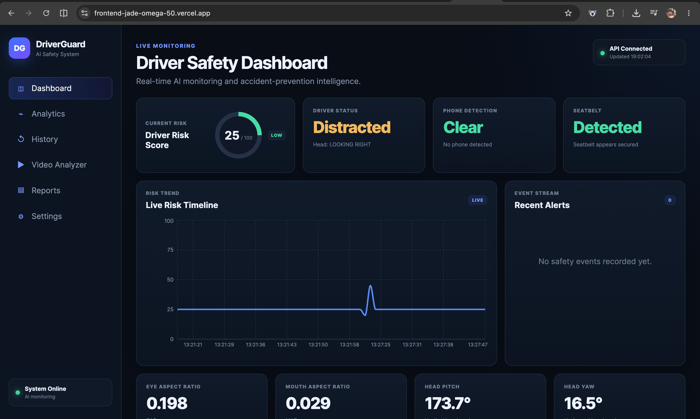
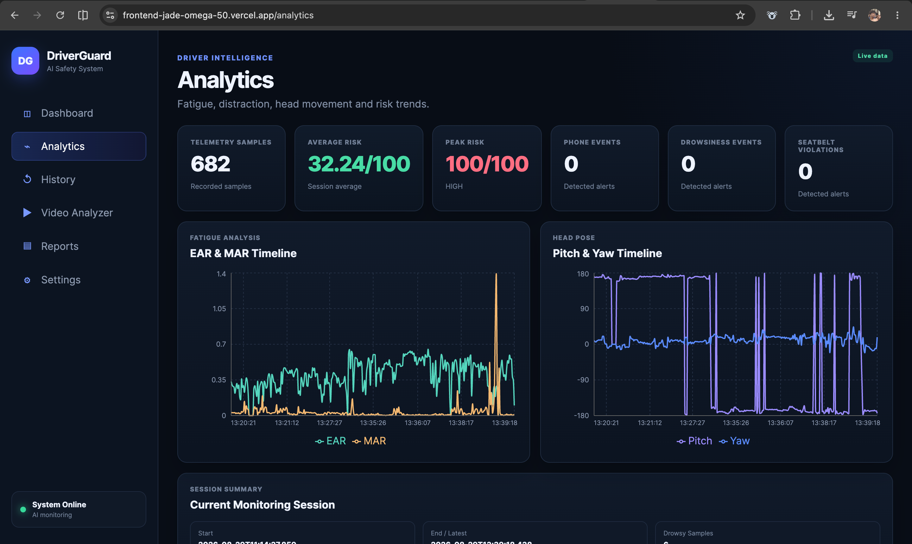
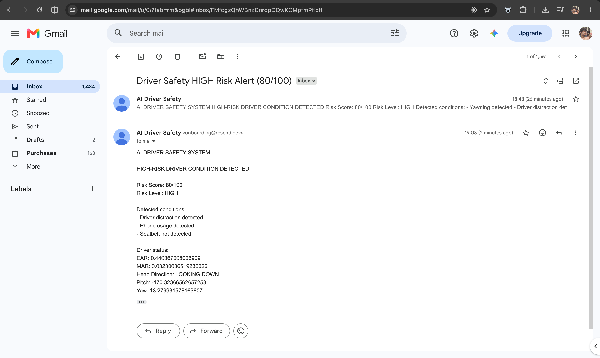

# 🚗 AI Driver Safety & Accident Prevention System

A real-time AI-powered driver monitoring platform that detects unsafe driving behavior, calculates a dynamic risk score, sends live telemetry to the cloud, displays analytics on a web dashboard, and automatically sends HIGH-risk email alerts.

This project combines **Computer Vision, Deep Learning, FastAPI, React, Docker, Railway, Vercel, real-time telemetry, analytics, reporting, and alerting** into one end-to-end driver safety system.

---

## 🌐 Live Deployment

**Frontend Dashboard**  
https://frontend-jade-omega-50.vercel.app/

**Backend API**  
https://ai-driver-safety-system-production.up.railway.app/

**Health Check**  
https://ai-driver-safety-system-production.up.railway.app/health

---

## 🎯 Project Objective

The system continuously monitors the driver using a camera and detects multiple unsafe conditions in real time.

When risk increases, the system can:

- Display visual warnings
- Play sound alerts
- Give voice warnings
- Log safety events
- Send live telemetry to the cloud
- Update a live analytics dashboard
- Store historical telemetry
- Analyze uploaded videos
- Generate PDF reports
- Send automatic HIGH-risk email alerts

---

## ✨ Main Features

### 👁️ Drowsiness Detection
Uses MediaPipe facial landmarks and Eye Aspect Ratio (EAR) to detect prolonged eye closure.

### 🥱 Yawn Detection
Uses Mouth Aspect Ratio (MAR) to detect sustained yawning.

### 👀 Head Pose & Distraction Detection
Uses facial landmarks and OpenCV pose estimation to detect looking left, right, up, down, and prolonged distraction.

### 📱 Phone Usage Detection
Uses **YOLOv8** object detection to detect mobile phone usage in real time.

### 🛡️ Seatbelt Detection
The current implementation uses a computer-vision heuristic that looks for a strong diagonal seatbelt-like line across the driver's torso region.

> ⚠️ The seatbelt detector is a prototype heuristic, not a dedicated trained seatbelt model.

---

## ⚠️ Dynamic Risk Scoring Engine

| Condition | Risk Weight |
|---|---:|
| Drowsiness | +45 |
| Yawning | +20 |
| Driver distraction | +25 |
| Phone usage | +35 |
| Seatbelt not detected | +20 |

The final score is capped at **100**.

```text
0–34    → LOW
35–69   → MEDIUM
70–100  → HIGH
```

---

## 🚨 Real-Time Alerts

The system supports:

- On-screen visual warnings
- macOS system sound alerts
- macOS voice alerts
- Automatic HIGH-risk email alerts

---

## 📧 Automatic HIGH-Risk Email Alerts

When the risk score reaches **70 or above**, the Railway backend sends an emergency email using the **Resend HTTPS API**.

A **5-minute cooldown** helps prevent repeated alert spam.

---

## ☁️ Live Cloud Telemetry

The local detector sends telemetry approximately every second to:

```text
POST /telemetry/live
```

Example payload:

```json
{
  "ear": 0.24,
  "mar": 0.15,
  "pitch": 2.0,
  "yaw": 5.0,
  "head_direction": "LOOKING FORWARD",
  "phone_detected": false,
  "seatbelt_detected": true,
  "drowsy": false,
  "yawning": false,
  "distracted": false,
  "risk_score": 0,
  "risk_level": "LOW"
}
```

---

## 🖥️ Live Analytics Dashboard

The React dashboard displays:

- Current risk score
- Risk level
- EAR / MAR
- Head direction
- Pitch / yaw
- Phone detection
- Seatbelt status
- Drowsiness / distraction
- Recent events
- Historical telemetry
- Risk, fatigue, head-pose, phone, and seatbelt charts

---

## 🏗️ System Architecture

```text
Driver Camera
     │
     ▼
OpenCV Frame Capture
     │
     ├───────────────┐
     │               │
     ▼               ▼
MediaPipe          YOLOv8
Face Landmarks     Phone Detection
     │               │
     └───────┬───────┘
             │
             ▼
     Driver State Detection
             │
             ▼
      Risk Scoring Engine
             │
             ├──────────────► Local Sound / Voice Alerts
             │
             ▼
       Live Telemetry
             │
             ▼
       FastAPI Backend
             │
             ▼
        Railway Cloud
             │
             ├──────────────► Persistent SQLite Storage
             ├──────────────► Resend Email API
             │
             ▼
        React Dashboard
             │
             ▼
            Vercel
```

---

## 🧠 Technology Stack

### AI / Computer Vision
- Python
- OpenCV
- MediaPipe
- YOLOv8
- Ultralytics
- NumPy

### Backend
- FastAPI
- Uvicorn
- SQLite
- Python

### Frontend
- React
- Vite
- Axios
- React Router
- Recharts

### Cloud / DevOps
- Docker
- Docker Compose
- Railway
- Railway Persistent Volumes
- Vercel
- Nginx
- GitHub

### Notifications
- Resend Email API
- macOS sound alerts
- macOS voice alerts

### Reporting
- ReportLab
- Matplotlib

---

## 🎥 Video Analysis

The backend supports uploaded-video analysis for driver-state detection and risk calculation.

---

## 📄 PDF Reports

The backend can generate downloadable PDF reports containing session information, driver risk statistics, safety events, risk charts, and detection summaries.

---

## 🔌 Main API Endpoints

| Endpoint | Method | Purpose |
|---|---|---|
| `/` | GET | API information |
| `/health` | GET | Backend health check |
| `/status` | GET | Latest driver status |
| `/risk` | GET | Risk summary |
| `/events` | GET | Recent safety events |
| `/analytics` | GET | Dashboard analytics |
| `/history` | GET | Telemetry history |
| `/telemetry/live` | POST | Receive live camera telemetry |
| `/video/analyze` | POST | Analyze uploaded video |
| `/reports/session` | GET | Generate session PDF |
| `/reports/video` | POST | Generate video report |

Interactive API docs are available at `/docs` on the backend URL.

---

## 💻 Running Locally

### 1. Clone the repository

```bash
git clone https://github.com/gurupavan7/ai-driver-safety-system.git
cd ai-driver-safety-system
```

### 2. Create and activate a Python 3.11 environment

```bash
python3.11 -m venv .venv
source .venv/bin/activate
```

### 3. Install dependencies

```bash
pip install -r requirements-docker.txt
```

### 4. Start live camera monitoring

```bash
python -m app.main
```

Press **Q** in the camera window to stop monitoring.

---

## 🖱️ One-Click macOS Launcher

For local demos, the project can also be started through a macOS app launcher:

```text
AI Driver Safety System.app
```

The launcher activates `.venv`, runs `python -m app.main`, opens camera monitoring, and sends telemetry to Railway.

---

## 🐳 Docker

```bash
docker compose up --build
```

---

## 🔐 Environment Variables

Example:

```text
RESEND_API_KEY=your_resend_api_key
ALERT_EMAIL_TO=your_email@example.com
PERSISTENT_ROOT=/data
```

Cloud secrets should be configured through Railway environment variables and never committed to Git.

---

## 🛡️ Safety & Limitations

This project is an AI / Computer Vision prototype and should not be treated as a certified automotive safety product.

Current limitations:

- Seatbelt detection uses a heuristic rather than a dedicated trained model
- Accuracy depends on lighting and camera angle
- Phone detection depends on object visibility
- Camera monitoring currently runs on the local machine
- Production vehicle deployment would require automotive-grade hardware, testing, and validation

---

## 🚀 Future Improvements

- Custom YOLO seatbelt model
- Driver identity recognition
- Multiple-driver support
- Vehicle speed integration
- GPS integration
- Emergency contact notification
- SMS / push notifications
- Mobile application
- Browser/WebRTC camera support
- Raspberry Pi / NVIDIA Jetson deployment
- Driver behavior prediction
- Accident detection
- Fleet management dashboard

---

## 💼 Portfolio Highlights

This project demonstrates experience with:

- Real-time Computer Vision
- Facial landmark analysis
- Object detection
- Risk-scoring algorithms
- Non-blocking cloud telemetry
- REST API development
- React dashboards
- Persistent cloud storage
- Automated notification systems
- Docker containerization
- Cloud deployment
- Video processing
- Analytics
- PDF reporting

---

## 👨‍💻 Author

**Guru Pavan**

AI / Machine Learning & Software Engineering Portfolio Project

GitHub: https://github.com/gurupavan7

---

## ✅ Project Status

```text
Real-Time Camera Detection       ✅
Drowsiness Detection             ✅
Yawn Detection                   ✅
Head Pose Detection              ✅
Phone Detection                  ✅
Seatbelt Prototype               ✅
Dynamic Risk Scoring             ✅
Sound / Voice Alerts             ✅
Event Logging                    ✅
Continuous Telemetry             ✅
FastAPI Backend                  ✅
React Dashboard                  ✅
Video Upload Analysis            ✅
PDF Reports                      ✅
Docker Deployment                ✅
Railway Backend                  ✅
Persistent Cloud Storage         ✅
Vercel Frontend                  ✅
Live Camera → Cloud              ✅
HIGH-Risk Email Alerts           ✅
One-Click Mac Launcher           ✅
```

---

⭐ If you find this project useful, consider starring the repository.

---

## 📸 Screenshots

### Live Dashboard



### Real-Time Camera Monitoring


### Analytics Dashboard



### HIGH-Risk Email Alert



---

## 🎬 Demo Flow

A recruiter/demo flow for this project:

1. Launch `AI Driver Safety System.app`
2. Camera monitoring starts automatically
3. Driver state is analyzed in real time
4. Telemetry is sent to Railway
5. Vercel dashboard updates live
6. HIGH-risk conditions trigger an email alert
7. Historical analytics and reports can be reviewed from the dashboard

